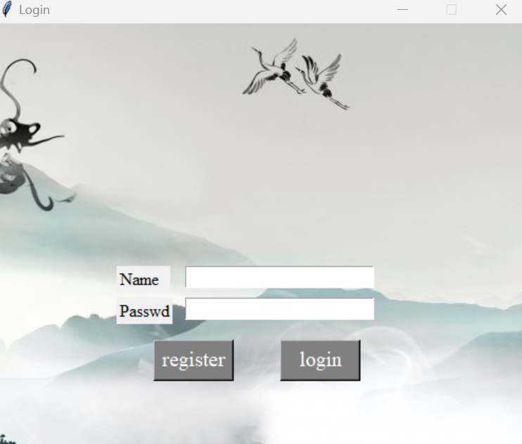
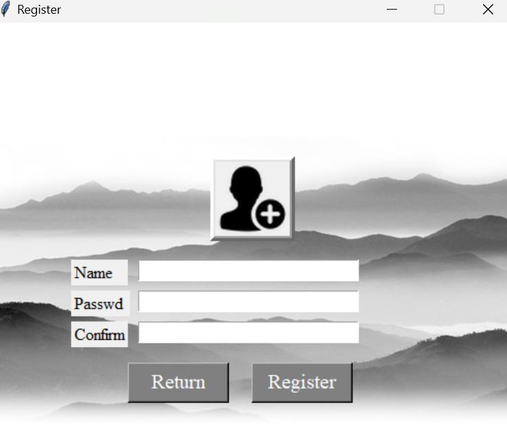

---


# Chinese ChatBot


​	A chat bot. Use **two-way GRU+attention** for training, tkinter for GUI. Dialogue with the chatbot through the registration and login mechanism. The chatbot uses **50,000** little yellow duck samples for training, using the results of the **75th** round of training. **Our chatbot is only for Chinese.**

------

## 0x00 chatbot setting

​	See the chatbot folder for details, where `config.ini` describes in detail the various configurations for training chatbot.

| name             | effect                                                       |
| ---------------- | ------------------------------------------------------------ |
| source_data      | train data source                                            |
| processor_result | come from source_data, there is no such file at the beginning |
| model_file       | where the model training is stored                           |
| samples_num      | number of samples for training                               |
| max_length       | the maximum number of tokens per sample                      |
| gate_loss        | the condition for the final training termination, generally 0.8 |

​	`main.py` is divided into training mode and test mode. If you start the training mode, just cancel the comment.

​	Start chatbot command:

```python
python3 main.py
```

​	This chatbot does not use parallel training, and it takes about 30 minutes to train a round (50000 samples) with `GTX 1050`. I have trained the model for 75 rounds and saved it in `seq2seqModel_75.pt`.

## 0x01 chatbot app

​	The `chatbot.exe` of this project adopts CS architecture. Specifically, the user first registers, and sends the user name and password to the server, and then the user logs in with the account, and finally can have a happy chat with the chatbot.

​	I have compiled this project as `chatbot.exe`, users who find it troublesome can use chatbot.exe directly, just to interact with my server.

​	If you want to deploy to your own server, you should do:

### Configure mysql

```
####### On your server #######
# Configure mysql
# You should make sure username:root and passwd:root
apt install mysql-server
mysql -u root -p root
create database chatbot_info;
use chatbot_info;
create table user_info (`user_name` varchar(255), `passwd` varchar(255), `filename` varchar(255));
insert into user_info (user_name, passwd, filename) values ("test", "test", "test");
```

### Copy

​	Put the `chat_mysql.py`, `server.py` and `bot_module` folders under your server chatbot folder. Then run the following command:

```
####### On your server #######
pip3 install pymysql, jieba, zhon
```

### Run

​	Modify the ip in `server.py` to `0.0.0.0`, and the port is arbitrary.

```
####### On your server #######
python3 server.py
###### On your computer ######
python3 main.py
```

​	or the `main.exe` is included in the dist folder, run it directly.

## 0x02 Project display

### Login



### Register



### Chat


